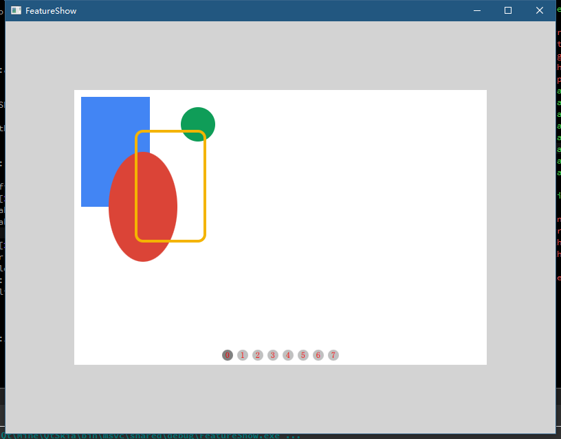
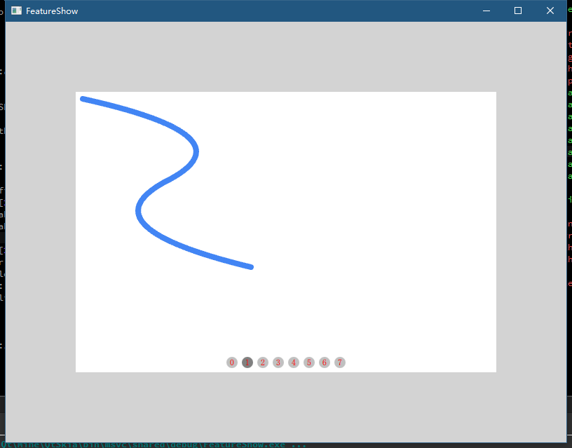
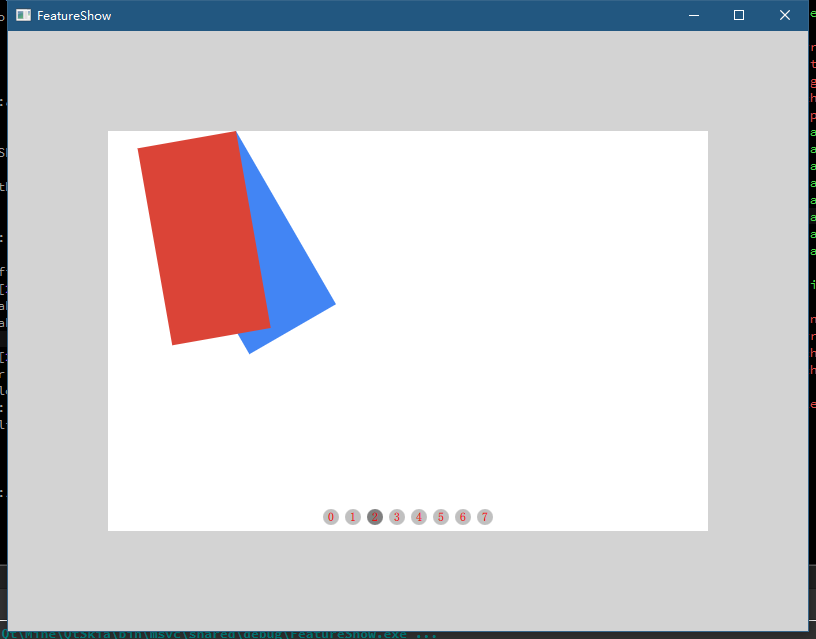
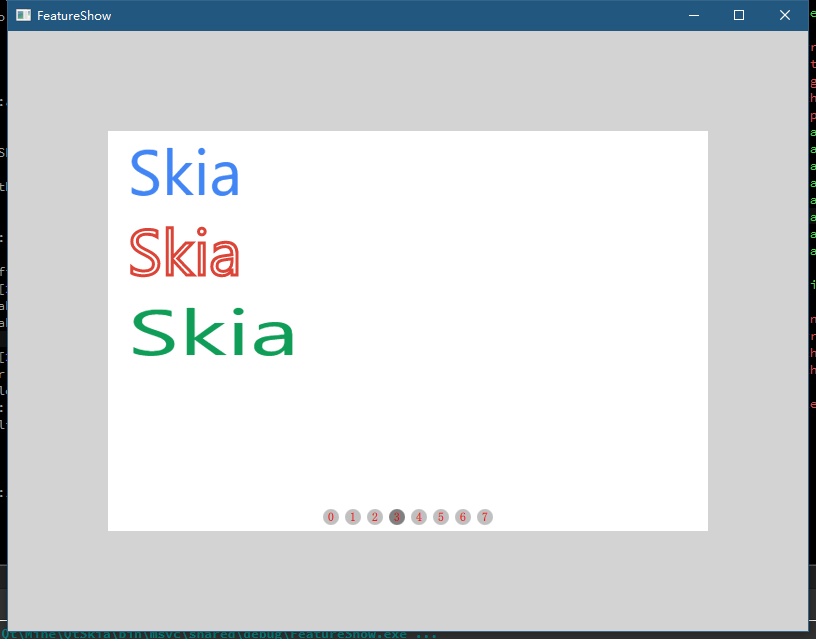
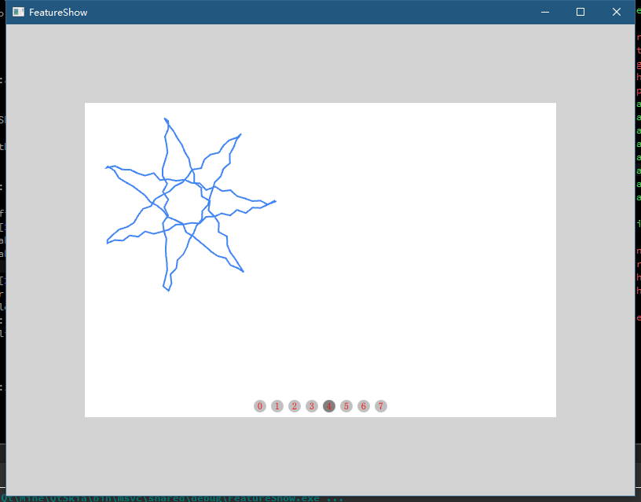
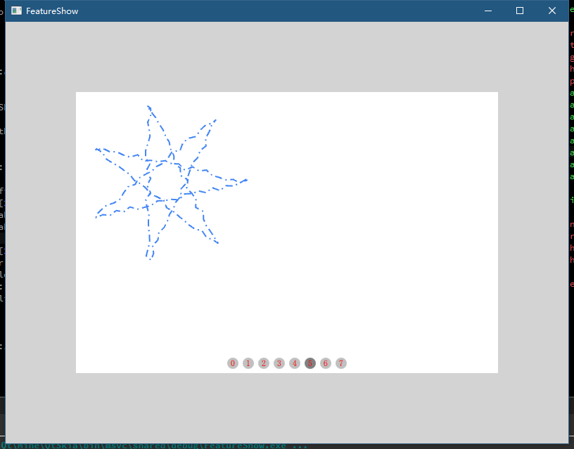
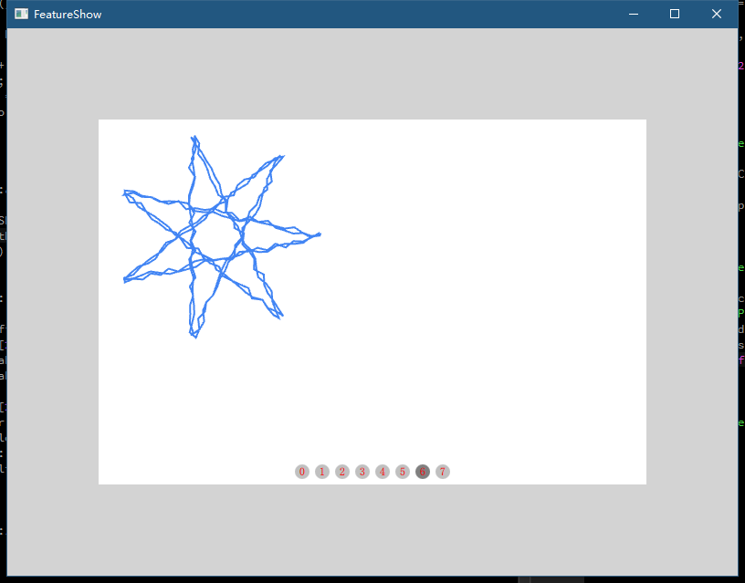
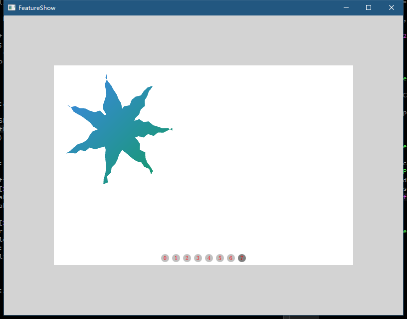

[English](README.md)

# QtSkia

[github原始仓库 https://github.com/QtSkia/QtSkia](https://github.com/QtSkia/QtSkia)

[gitee镜像 https://gitee.com/QtSkia/QtSkia](https://gitee.com/QtSkia/QtSkia)

# 目录

- [QtSkia](#qtskia)
- [目录](#%e7%9b%ae%e5%bd%95)
- [简介](#%e7%ae%80%e4%bb%8b)
  - [Skia](#skia)
  - [QtSkia](#qtskia-1)
- [CI徽章](#ci%e5%be%bd%e7%ab%a0)
- [特性展示](#%e7%89%b9%e6%80%a7%e5%b1%95%e7%a4%ba)
  - [几何形状](#%e5%87%a0%e4%bd%95%e5%bd%a2%e7%8a%b6)
  - [贝塞尔曲线](#%e8%b4%9d%e5%a1%9e%e5%b0%94%e6%9b%b2%e7%ba%bf)
  - [平移和旋转](#%e5%b9%b3%e7%a7%bb%e5%92%8c%e6%97%8b%e8%bd%ac)
  - [文字渲染](#%e6%96%87%e5%ad%97%e6%b8%b2%e6%9f%93)
  - [离散路径特效](#%e7%a6%bb%e6%95%a3%e8%b7%af%e5%be%84%e7%89%b9%e6%95%88)
  - [合成路径特效](#%e5%90%88%e6%88%90%e8%b7%af%e5%be%84%e7%89%b9%e6%95%88)
  - [叠加路径特效](#%e5%8f%a0%e5%8a%a0%e8%b7%af%e5%be%84%e7%89%b9%e6%95%88)
  - [着色器](#%e7%9d%80%e8%89%b2%e5%99%a8)
- [计划与进度](#%e8%ae%a1%e5%88%92%e4%b8%8e%e8%bf%9b%e5%ba%a6)
- [编译和发布](#%e7%bc%96%e8%af%91%e5%92%8c%e5%8f%91%e5%b8%83)
- [QtSkia使用示例](#qtskia%e4%bd%bf%e7%94%a8%e7%a4%ba%e4%be%8b)
- [工程结构](#%e5%b7%a5%e7%a8%8b%e7%bb%93%e6%9e%84)
- [赞助](#%e8%b5%9e%e5%8a%a9)
- [联系作者](#%e8%81%94%e7%b3%bb%e4%bd%9c%e8%80%85)

# 简介

## Skia

Skia是一个开源的二维图形库，提供各种常用的API，并可在多种软硬件平台上运行。

谷歌Chrome浏览器、Chrome OS、Fuchsia、安卓、Flutter、火狐浏览器、火狐操作系统以及其它许多产品都使用它作为图形引擎。

Skia由谷歌出资管理，任何人都可基于BSD免费软件许可证使用Skia。

Skia开发团队致力于开发其核心部分， 并广泛采纳各方对于Skia的开源贡献。

* 源代码: skia.googlesource.com/skia.

* 提议: bug.skia.org.

* 论坛: skia-discuss@googlegroups.com.

* skia官网： https://skia.org

* 谷歌github镜像: https://github.com/google/skia.git

## QtSkia

QtSkia是在Qt框架中集成skia，实现的二维图形库。

QtSkia提供了QWidget、QOpenGLWidget、QQuickWindow、QQuickItem等常用Qt渲染组件与skia的对接，

可以方便地将skia引入到现有Qt项目中。

# CI徽章

| [Windows][win-link]|[MacOS][macos-link]| [Ubuntu][ubuntu-link]|[Android][android-link]|[IOS][ios-link]|
|---------------|---------------|-----------------|-----------------|----------------|
| ![win-badge]  |![macos-badge] | ![ubuntu-badge]      | ![android-badge]   |![ios-badge]   |

|[License][license-link]| [Release][release-link]|[Download][download-link]|[Issues][issues-link]|[Wiki][wiki-links]|
|-----------------|-----------------|-----------------|-----------------|-----------------|
|![license-badge] |![release-badge] | ![download-badge]|![issues-badge]|![wiki-badge]|

[win-link]: https://github.com/JaredTao/QtSkia/actions?query=workflow%3AWindows "WindowsAction"
[win-badge]: https://github.com/JaredTao/QtSkia/workflows/Windows/badge.svg  "Windows"

[ubuntu-link]: https://github.com/JaredTao/QtSkia/actions?query=workflow%3AUbuntu "UbuntuAction"
[ubuntu-badge]: https://github.com/JaredTao/QtSkia/workflows/Ubuntu/badge.svg "Ubuntu"

[macos-link]: https://github.com/JaredTao/QtSkia/actions?query=workflow%3AMacOS "MacOSAction"
[macos-badge]: https://github.com/JaredTao/QtSkia/workflows/MacOS/badge.svg "MacOS"

[android-link]: https://github.com/JaredTao/QtSkia/actions?query=workflow%3AAndroid "AndroidAction"
[android-badge]: https://github.com/JaredTao/QtSkia/workflows/Android/badge.svg "Android"

[ios-link]: https://github.com/JaredTao/QtSkia/actions?query=workflow%3AIOS "IOSAction"
[ios-badge]: https://github.com/JaredTao/QtSkia/workflows/IOS/badge.svg "IOS"

[release-link]: https://github.com/jaredtao/QtSkia/releases "Release status"
[release-badge]: https://img.shields.io/github/release/jaredtao/QtSkia.svg?style=flat-square "Release status"

[download-link]: https://github.com/jaredtao/QtSkia/releases/latest "Download status"
[download-badge]: https://img.shields.io/github/downloads/jaredtao/QtSkia/total.svg?style=flat-square "Download status"

[license-link]: https://github.com/jaredtao/QtSkia/blob/master/LICENSE "LICENSE"
[license-badge]: https://img.shields.io/badge/license-MIT-blue.svg "MIT"

[issues-link]: https://github.com/jaredtao/QtSkia/issues "Issues"
[issues-badge]: https://img.shields.io/badge/github-issues-red.svg?maxAge=60 "Issues"

[wiki-links]: https://github.com/jaredtao/QtSkia/wiki "wiki"
[wiki-badge]: https://img.shields.io/badge/github-wiki-181717.svg?maxAge=60 "wiki"
# 特性展示

## 几何形状

## 贝塞尔曲线

## 平移和旋转

## 文字渲染

## 离散路径特效

## 合成路径特效

## 叠加路径特效

## 着色器

# 计划与进度

* 代码镜像
- [x] skia源码镜像
- [x] 依赖库源码镜像
- [x] 自动化同步上游代码
- [x] 本地自动拉取脚本

* 编译与CI
- [x] 制定Qt编译流程
- [x] Windows平台自动编译
- [X] MacOS平台自动编译
- [ ] Linux平台自动编译
- [ ] Android平台自动编译

* 效果
- [x] 简单画线、文字
- [X] Skia内置特效
- [ ] 贴图，支持常见图片格式
- [ ] Lottie绘制

* Qt框架适配

1. Gui模块
- [x] QOpenGLWindow
- [ ] QWindow
- [ ] QVulkanWindow

2. Widget模块
- [x] QWidget CPURaster
- [x] QOpenGLWidget

3. Quick模块
- [x] QOuickWindow
- [X] QQuickItem
- [ ] QQuickFrameBuffer

4. Qt6 RHI支持
- [ ] 待补充 

* 性能测试对比
- [ ] 基本图形大规模绘制
- [ ] 动画
- [ ] 待补充

# 编译和发布

[编译和发布](doc/Build-zh.md)

# QtSkia使用示例

[使用示例](doc/Examples-zh.md)

# 工程结构

|目录|用途|
|:-----------:|:-------------:|
|3rdparty|第三方库，skia|
|doc|文档|
|examples|一些用例|
|QtSkia|QtSkia库|
|skiaBuild|skia编译相关配置|
|tests|单元测试、性能测试|

# 赞助

为众人抱薪者, 不可使其冻毙于风雪。

如果您觉得这个项目还不错，请打赏一下作者。

# 联系作者

|-|-|
| ---- | -------------------------------- |
| 作者 | 武威的涛哥                           |
| 博客 | https://jaredtao.github.io/ |
| 博客-gitee镜像|https://jaredtao.gitee.io|
| 知乎专栏| https://zhuanlan.zhihu.com/TaoQt |
| QQ群| 734623697(高质量群，大佬多、不灌水）|
| 邮箱 | jared2020@163.com                |
| 微信 | xsd2410421                       |
| QQ、TIM | 759378563                      |
