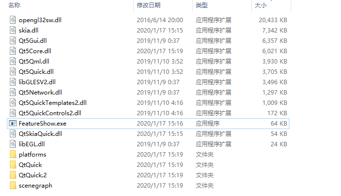

# 编译

## 依赖环境

python 2

Qt 5.12.x 64-bit

注意:32bit/x86架构,只能使用google提供的工具链，QtSkia未做支持, 具体请参考skia官网：https://skia.org/user/build

### windows

编译器需要使用vs2017及以上,有clang-cl更好。

### MacOS

待补充

### Android

待补充

### Linux

待补充

## 源码下载

1. 下载QtSkia

```shell
git clone https://github.com/QtSkia/QtSkia.git
```

国内用户可以使用gitee同步镜像，速度更快。

```shell
git clone https://gitee.com/QtSkia/QtSkia.git
```

2. 下载skia及依赖库

执行QtSkia根目录的syncSkia脚本，即可自动从github下载所有依赖项。

(国内用户也可以使用syncSkia-gitee脚本代替, 从gitee下载同步镜像，速度更快。)

Windows环境双击运行syncSkia.bat， 或者命令行：
```bat
cd QtSkia
syncSkia.bat
```

MacOS 或 linux环境, 命令行执行脚本
```shell
cd QtSkia
chmod a+x syncSkia.sh
./syncSkia.sh
```

### skia及依赖库的说明

skia官方仓库在 https://skia.googlesource.com/skia

github上面也有官方的镜像 https://github.com/google/skia

skia的依赖库将近30个。

QtSkia在github、gitee提供了全部的同步镜像仓库，详情见：

https://github.com/QtSkia

https://gitee.com/QtSkia

QtSkia提供的仓库，会使用自动化工具定期同步google上游仓库。

QtSkia不修改skia及依赖库的源码，仅使其增加github、gitee镜像支持和必要的编译器支持。

## 编译

使用QtCreator导入QtSkia.pro，或者使用Qt命令行

```shell
qmake 
make
```

# 发布

1. 常规的Qt程序发布流程，例如windeployqt、macdeployqt。

2. 添加QtSkia 和 skia库。

例如Windows平台的FeatureShow程序，只要添加QtSkiaQuick.dll 和 skia.dll两个文件就可了。

Release模式的'skia.dll'文件大小 7.16 MB. 

'QtSkiaQuick.dll' 文件大小 54 KB.
